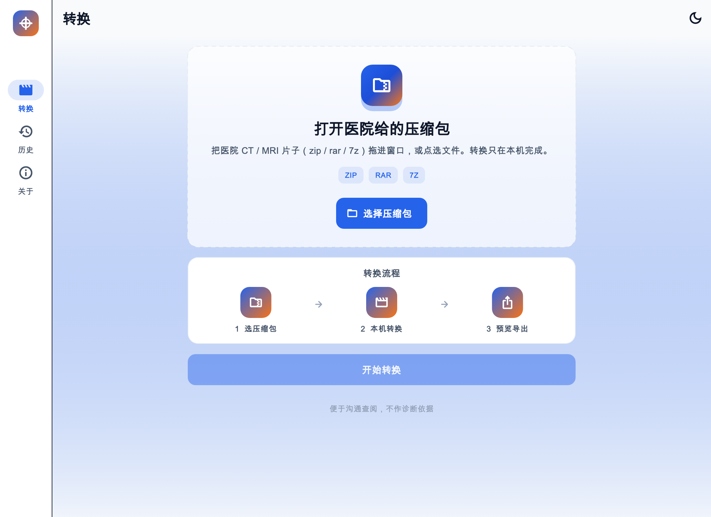

# DicomFlow App

把医院拷给你的 **CT / MRI 片子**在**本机**转成 MP4 或 GIF，用普通播放器就能看，不必装专业阅片软件。

[English](README.md)

<p align="center">
  
</p>

全程**离线**。便于沟通查阅，**不作诊断依据**。

## 下载

安装包在 [Releases](https://github.com/AlexWuYh/DicomFLow-App/releases/latest)：

| 平台 | 文件 | 说明 |
|------|------|------|
| **Android** | `DicomFlow-v*-android.apk` | 直接安装 APK，未上架应用商店 |
| **Windows** | `DicomFlow-v*-windows.zip` | 解压即用，已含 ffmpeg 和 7-Zip |
| macOS | `DicomFlow-v*-macos.zip` | 方便在 Mac 上试用，不是商店版 |

产品目标是 Android 与 Windows。

## 怎么用

1. 打开医院给的 zip / rar / 7z。
2. 选 **MP4**（发给医生播放更合适）或 **GIF**。多个序列可以合并成一个文件。
3. 按片预览，捏合或滚轮放大，然后 **分享此文件**，或 **导出** 全部结果（带日期的 zip）。

**分享**只发送正在预览的那一个文件。**导出**才打包全部结果。

历史只留在本机，可设 1 / 7 / 30 天。缩短保留时间会删文件，需确认。

## 不会做的事

- 诊断：没有测量、调窗、MPR
- 上传：除非你自己分享，影像不会离开这台设备
- 账号、密码、云端

## 从源码构建

需要 Flutter 3.44+。

```bash
cd dicomflow_app
flutter pub get
dart run tool/fetch_ffmpeg.dart   # macOS / Windows 打进包内，约一次
dart run tool/fetch_7zip.dart     # 捆绑 7-Zip，解压 rar / 7z
flutter test
flutter run -d macos
```

日常在 **`dev`** 开发。发版合进 **`main`**。打并推送 **`v*`** 标签才会出安装包。打标签前把本版说明写进 [`.github/release-notes.md`](.github/release-notes.md)。

引擎：[DicomFlow](https://github.com/AlexWuYh/DicomFlow)。协作者说明：[AGENTS.md](./AGENTS.md)。

## 支持转换的片源

| 你拿到的 | 能转的 |
|----------|--------|
| 医院 CT / MRI 片子 | DICOM 影像（医院拷盘、光盘里常见的那种） |
| 压缩包 | zip、rar、7z |
| 包里的文件 | `.dcm`、`.dicom`、`.ima`，或没有后缀的 DICOM |
| 转成 | MP4 视频或 GIF 动图 |

常见未压缩、JPEG、RLE 片子可以转。JPEG 2000 等特殊压缩可能转不了，可让医院改导出未压缩或 JPEG。

## 许可

MIT（[LICENSE](./LICENSE)）。捆绑的 FFmpeg（libx264）为 GPL-3.0；带编码器的安装包按 GPL-3.0 分发。捆绑的 7-Zip 为 LGPL（含 unRAR 限制）。
